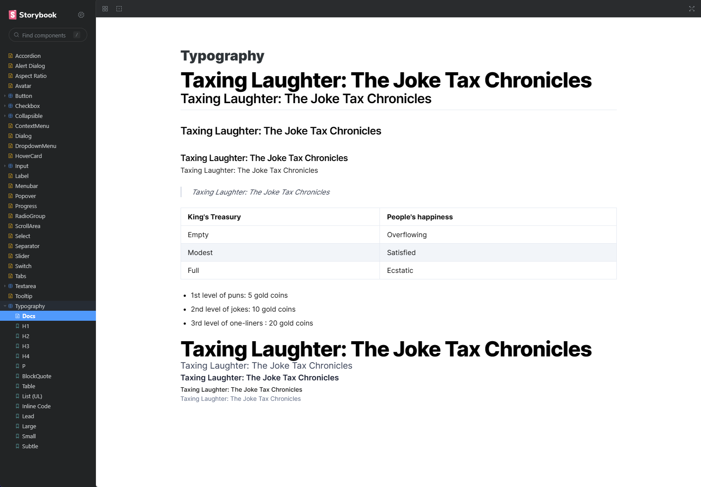

# shadcn/ui

Beautifully designed components built with Radix UI and Tailwind CSS.


## Roadmap

> **Warning**
> This is work in progress. I'm building this in public. You can follow the progress on Twitter [@shadcn](https://twitter.com/shadcn).

- [ ] Toast
- [ ] Toggle
- [ ] Toggle Group
- [ ] Toolbar
- [x] ~Navigation Menu~
- [ ] Figma?

## Storybook

Storybook is supported so that you can easily select the correct component and view its properties



To open Storybook, run the following:

```bash
cd apps/www
npm i
npm run storybook
```

## Use in your own project

Starting a new project? Check out the Next.js template.

```bash
npx create-next-app -e https://github.com/shadcn/next-template
```

### Features

- Radix UI Primitives
- Tailwind CSS
- Fonts with `@next/font`
- Icons from [Lucide](https://lucide.dev)
- Dark mode with `next-themes`
- Automatic import sorting with `@ianvs/prettier-plugin-sort-imports`
- Storybook support (Thanks [@XavierGeerinck](https://twitter.com/XavierGeerinck))

### Tailwind CSS Features

- Class merging with `tailwind-merge`
- Animation with `tailwindcss-animate`
- Conditional classes with `clsx`
- Variants with `class-variance-authority`
- Automatic class sorting with `eslint-plugin-tailwindcss`

## License

Licensed under the [MIT license](https://github.com/shadcn/ui/blob/main/LICENSE.md).
