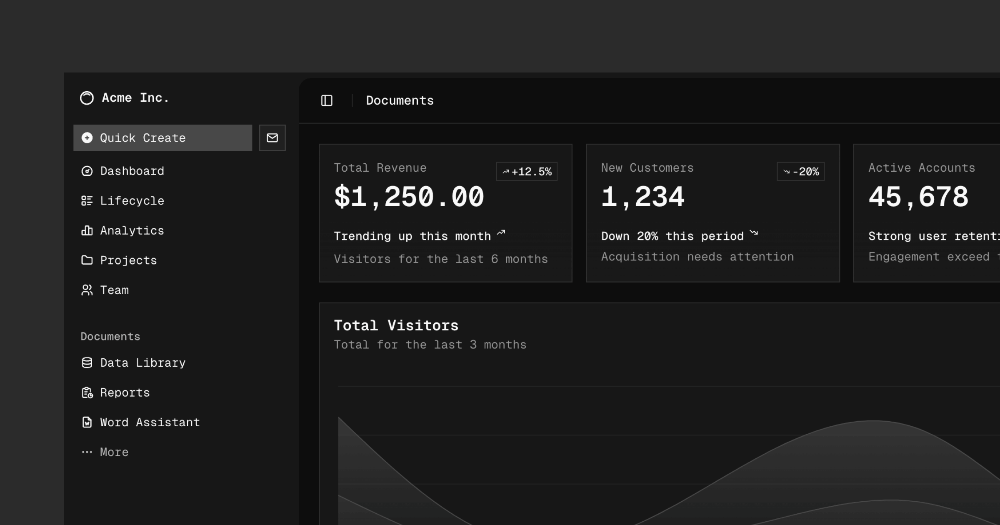

# shadcn/ui

A set of beautifully designed components that you can customize, extend, and build on. Start here then make it your own. Open Source. Open Code. **Use this to build your own component library**.

## Documentation

Visit http://ui.shadcn.com/docs to view the documentation.

## Contributing

Please read the [contributing guide](/CONTRIBUTING.md).

## License

Licensed under the [MIT license](https://github.com/shadcn/ui/blob/main/LICENSE.md).

