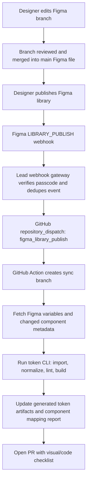
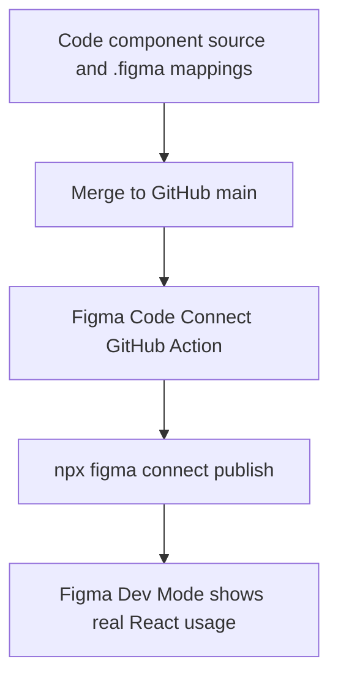

# Figma to Code Sync Process

This document defines how Lead's Figma design-system library should stay connected to the GitHub component library without allowing silent, unreviewed code changes.

## Goals

- Keep Figma variables, token JSON, generated CSS, and React components aligned.
- Let designers work in Figma branches and publish the library when a design-system change is ready.
- Turn Figma library publishes into reviewed GitHub pull requests.
- Publish Code Connect mappings from GitHub back into Figma so Dev Mode points designers and engineers at the real React components.

## Non-Goals

- Figma does not directly push to `main`.
- A Figma branch merge does not automatically rewrite source components.
- Code Connect is not treated as a code generator. It maps Figma components to code snippets and component APIs.

## Source of Truth

Lead uses a split-source model:

| Layer | Source of truth | Sync direction |
| --- | --- | --- |
| Primitive and semantic values | Figma variables after library publish | Figma to token CLI to code |
| Token governance | `packages/lead-design-tokens-cli/docs/` and authored token files | GitHub to CI |
| React component APIs | GitHub component source | GitHub to Code Connect to Figma |
| Component visuals | Figma library components and GitHub implementation together | Reviewed PRs reconcile both |

## Recommended Release Gate

Use **Figma library publish** as the automation trigger.

The designer workflow is:

1. Create a Figma branch from the main design-system file.
2. Edit variables and components on the branch.
3. Review and merge the branch into the main Figma file.
4. Publish the Figma library.
5. Let the `LIBRARY_PUBLISH` webhook trigger a GitHub PR.

This is safer than triggering on every branch merge because publishing is the intentional "this is ready for consumers" moment and the webhook payload can include published variables, styles, and components.

## Automation Architecture



## Code Connect Architecture

Code Connect runs in the opposite direction: GitHub publishes mappings to Figma.



Use `figma.config.json` to tell the Code Connect CLI where mappings live. The first mappings should be created for:

- `Button`
- `Input`
- `Select`
- `Card`
- `Dialog`
- `Table`
- `Sidebar`

Each mapping should connect one published Figma component or component set to one code component.

## Required Secrets and Settings

GitHub repository secrets:

- `FIGMA_ACCESS_TOKEN`: Figma personal access token used by Code Connect and any future Figma API reads.
- `FIGMA_WEBHOOK_PASSCODE`: shared secret used by the webhook gateway to verify Figma webhook calls.
- `FIGMA_FILE_KEY`: `f2gKVfCJNOS0MeLUk4CM8u` for the current staging library.

GitHub repository variables:

- `FIGMA_CODE_CONNECT_ENABLED=true` enables `.github/workflows/figma-code-connect.yml`.

Figma setup:

- Publish the design-system file as a team library.
- Register a `LIBRARY_PUBLISH` webhook for that file or team.
- Point the webhook to the Lead webhook gateway endpoint.

## Webhook Gateway Contract

The gateway should be a small service, not the GitHub Action itself. Its responsibilities:

1. Verify the webhook `passcode`.
2. Ignore unsupported event types.
3. Dedupe repeated webhook deliveries.
4. Store the raw webhook payload for audit.
5. Dispatch GitHub workflow event `figma_library_publish`.

Suggested `repository_dispatch` payload:

```json
{
  "event_type": "figma_library_publish",
  "client_payload": {
    "file_key": "f2gKVfCJNOS0MeLUk4CM8u",
    "timestamp": "2026-04-26T00:00:00Z",
    "figma_webhook_id": "example",
    "library_publish": {
      "components": [],
      "styles": [],
      "variables": []
    }
  }
}
```

## Pull Request Rules

The automation may create a PR, but it must not merge it.

Every Figma-triggered PR should include:

- Figma file link and publish timestamp.
- Token files changed.
- Component mappings or component files changed.
- Screenshots or links for any visual component changes.
- Results from `lead:tokens:test`, `lead:tokens:lint-schemas`, and `lead:tokens:check-decisions`.
- A human checklist for visual review.

## Component Change Policy

Tokens can be automated first. Component source changes should be more conservative:

1. Detect changed published Figma components from the webhook payload.
2. Look up the component in a checked-in component map.
3. If the change only affects variables, let token generation update code.
4. If layout, variants, or props changed, open a PR with a generated report and require human review.
5. Only let agents update one component per PR until the pipeline is trusted.

## Implementation Phases

### Phase 1: Code Connect

- Publish the Figma library.
- Add `.figma.tsx` or `.figma.js` mappings for the core components.
- Set `FIGMA_ACCESS_TOKEN`.
- Set `FIGMA_CODE_CONNECT_ENABLED=true`.
- Run `npm run figma:code-connect:dry-run`.
- Run `npm run figma:code-connect:publish`.

### Phase 2: Token Pull

- Add a `figma` import source to `packages/lead-design-tokens-cli`.
- Fetch local Figma variables from the staging file.
- Normalize Figma variables into the existing token schema.
- Generate CSS variables and Tailwind outputs.
- Open PRs for token-only changes.

### Phase 3: Library Publish Webhook

- Build the webhook gateway.
- Register the `LIBRARY_PUBLISH` webhook in Figma.
- Add a GitHub Action for `repository_dispatch`.
- Make that Action run the token pull and open a PR.

### Phase 4: Component Reconciliation

- Add a checked-in component map from Figma component node IDs to code files.
- For component changes, generate a report first.
- After the report workflow is stable, allow agent-authored component PRs.

## Manual MVP Workflow

Until the webhook gateway exists:

1. Publish the Figma library.
2. Run token sync locally once implemented.
3. Run:

```bash
npm run lead:tokens:test
npm run lead:tokens:lint-schemas
npm run lead:tokens:check-decisions
```

4. Commit changes to a branch.
5. Open a PR.
6. After merge, run:

```bash
npm run figma:code-connect:publish
```

## References

- [Figma Webhooks V2](https://developers.figma.com/docs/rest-api/webhooks/) describes webhook contexts, permissions, and event delivery.
- [Figma webhook events](https://developers.figma.com/docs/rest-api/webhooks-events/) documents `LIBRARY_PUBLISH` and its created/modified component, style, and variable payloads.
- [Figma Variables REST API](https://developers.figma.com/docs/rest-api/variables/) documents the Enterprise, seat, permission, and token-scope requirements for variable sync.
- [Figma Variables endpoints](https://developers.figma.com/docs/rest-api/variables-endpoints/) documents local and published variable endpoints.
- [Figma Code Connect](https://developers.figma.com/docs/code-connect/) explains Code Connect as the bridge between Figma Dev Mode and production components.
- [Code Connect CLI quickstart](https://developers.figma.com/docs/code-connect/quickstart-guide/) documents `figma.config.json`, template files, and `npx figma connect publish`.
- [Code Connect CI/CD](https://developers.figma.com/docs/code-connect/ci-cd/) documents publishing Code Connect mappings from GitHub Actions.
